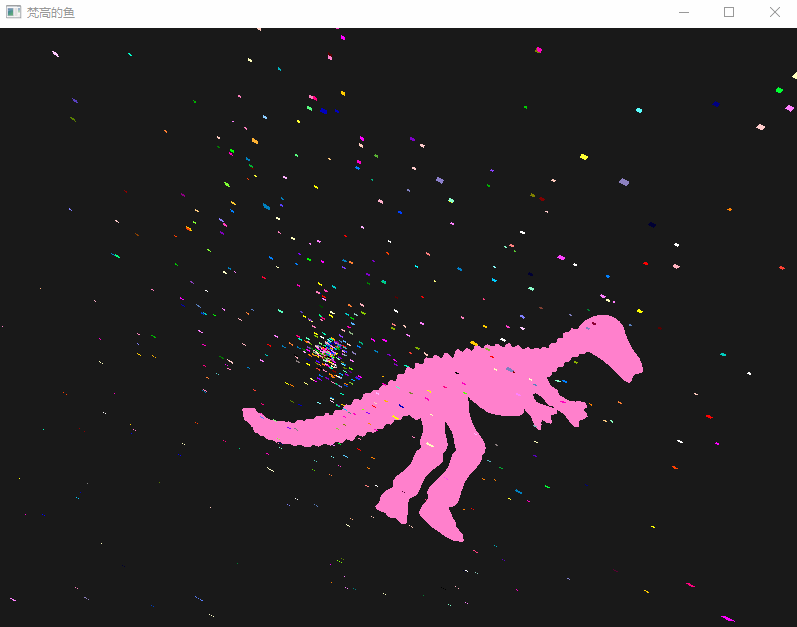

# Van Gogh's fish
A **particle system**, named as **Van Gogh's fish**, released in June 6, 2016.

## Code

* The **model loading module** is from the internet
* key code is OpenGLDemo.cpp including particle system.

## Hot key table
| key                                | Function                                       |
| ---------------------------------- | ---------------------------------------------- |
| move the mouse                     | transform model orientation                    |
| ***O***                            | load models（**model path** OpenGLDemo\Model） |
| ***Num 1 to 9*** and ***Q W E R*** | transform model color                          |
| **+**                              | zoom in                                        |
| **-**                              | zoom out                                       |

## Demo-1

## Demo-2

# Issues
Please ask here https://github.com/Guguant/anaian-particle-system/issues. Thanks.

# Contact
zscandyz[you know]gmail[dot]com